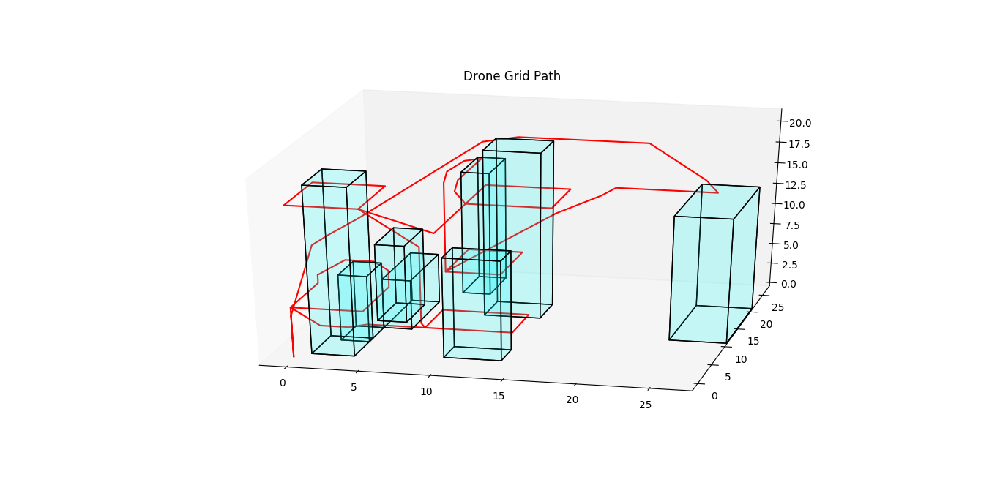
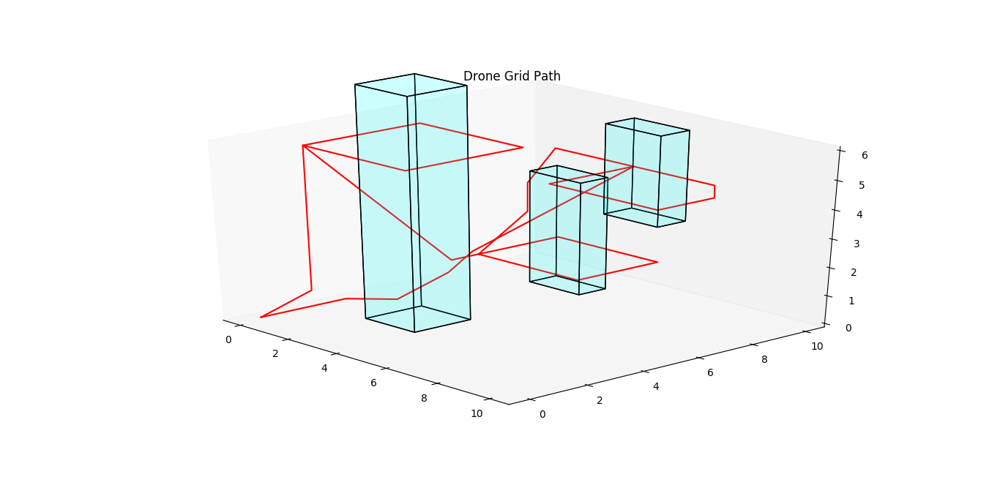
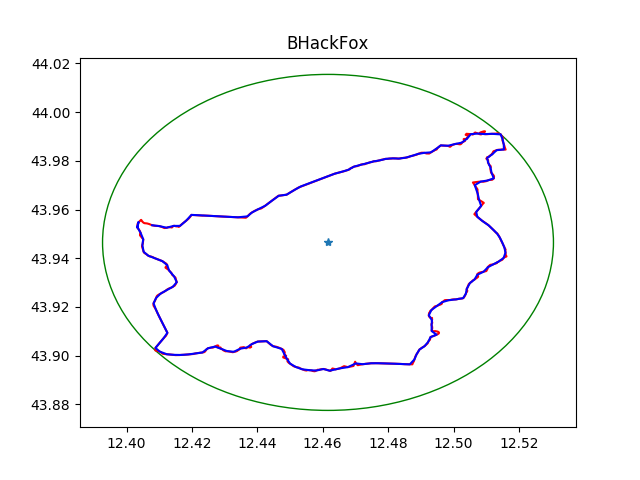
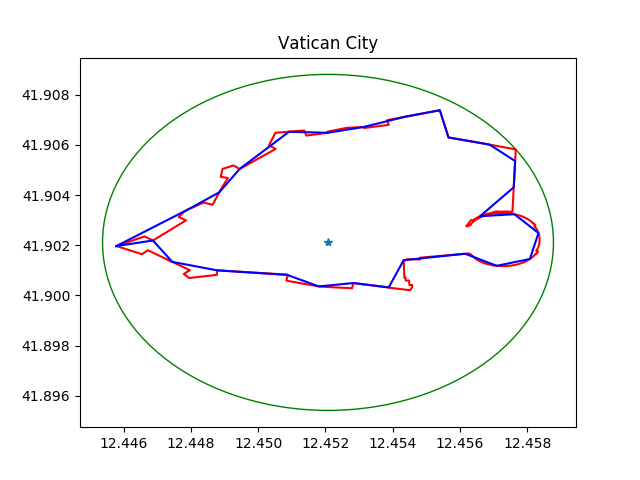

# UAV-Drone-Path


[`federico-rosatelli`](https://github.com/federico-rosatelli)

# Description
UAV-Drone-Path is a package which allows you to create a coordinate grid with objects, called obstacles, and control a virtual drone. Once instructed in the actions to perform, he will perform them avoiding obstacles and completing the various objectives. Once the route is finished you can view the grid and the route used by the drone.




# Usage
`test1.py` & `test2.py` provide a semi-complete guide on how to use this package.

To get started import the command file from uav:
```python
from uav import command
```

Now you can create the first Command and Drone object as:
```python
comm = command.NewCommand('grid_file')
drone = command.NewDrone(comm,"Drone_Type","Drone_Name",[100,200,201,300],100)
```

To execute and create an action use:
```python
comm.createAction("Name_of_Action",drone,COMMAND_INT,comm.returnObstacle(OBSTACLE_NUM),HEIGHT_INT)
```

The grid display is made available by the method `display()` of the Command class.

# The Grid
To create you personal grid you have to create a .txt file like this:
```
0,0,0 20,20,20  //first and last coordinate of you grid
2,2,0 4,5,15    //first and last coordinate of your obstacle
7,16,2 10,17,20 //first and last coordinate of your obstacle
```
Remember that each coordinate is `(x,y,z)` formatted

# Field based on Border
This part of the library is based on the creation of a field from geographical coordinates which can be understood as borders of states and/or geographical areas.

The creation of the field occurs via the `field` module. Through a few simple instructions, complex routes can be created that allow a drone to inspect well-defined areas of the border.




## Usage
The use of this module is exactly the same as the previous one.

Import the command file from uav:
```python
from uav import command
```

You can create a Field class as:
```python
field = command.NewField(name="BHackFox")
field.CreateField("italy/italy_border.csv",1)

```

To execute and create a field path with visual result:
```python
coordinates = field.GetCoordinates()
drone_path = field.DronePathBorder()
field.DisplayBorderPath()
```


# Why?
Because I was bored and I like UAV and drones :)

# WARINNG
This package is not completed.

## TODO
- [x] Best Path Finder
- [x] Dinamic Obstacle with file
- [x] Grid Display
- [x] Drone Battery Usage
- [x] Rotation Action
- [x] Hawk's View Action
- [x] 2D View of field
- [x] Best path border control
- [ ] Obstacle identifier in field control
- [ ] Implement More Action
- [ ] Live Drone Test
- [ ] Panorama mapping and Grid Implementation
